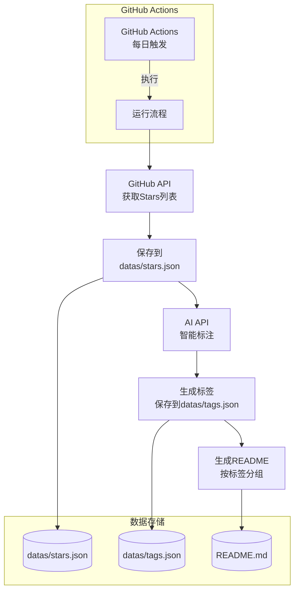

# GitHub Stars 自动标注与README生成系统

## 项目架构



## 文件结构

```
StarsBoard/
├── package.json                 # 项目配置和依赖
├── .env.example                 # 环境变量示例
├── README.md                    # 生成的Stars展示文档
├── datas/
│   ├── stars.json              # Stars数据缓存
│   └── tags.json               # 标签数据
├── src/
│   ├── index.js                # 主程序入口
│   ├── github.js               # GitHub API交互
│   ├── ai.js                   # AI API交互
│   ├── tag.js                  # 标签管理
│   └── readme.js               # README生成
└── .github/
    └── workflows/
        └── daily-stars.yml     # GitHub Actions配置
```

## 实现步骤

### 1. 项目初始化

创建 [package.json](package.json) 配置依赖：

- `openai` - OpenAI SDK (支持环境变量配置 API URL、Key 和 Model)
- `dotenv` - 环境变量管理

### 2. GitHub API模块 ([src/github.js](src/github.js))

- 实现获取用户所有stars的功能
- 使用GitHub REST API: `GET /user/starred`
- 支持分页获取（每页100条）
- 从环境变量读取GitHub Token和用户名
- 返回stars数据：仓库ID、名称、描述、语言、URL等

### 3. AI标注模块 ([src/ai.js](src/ai.js))

- 使用 OpenAI SDK 创建客户端，支持通过环境变量配置：
  - `OPENAI_BASE_URL` - API 地址
  - `OPENAI_API_KEY` - API 密钥
  - `AI_MODEL` - 使用的模型名称
- 为每个stars仓库调用 OpenAI API
- 传入仓库信息（名称、描述、语言）让 AI 生成标签
- AI返回标签数组（自动创建新标签）
- 实现批量处理以减少API调用

### 4. 标签管理模块 ([src/tag.js](src/tag.js))

- 从 [datas/tags.json](datas/tags.json) 读取已有标签
- 合并AI返回的新标签
- 按标签分组stars数据
- 保存更新后的标签数据

### 5. README生成模块 ([src/readme.js](src/readme.js))

- 按标签分组生成Markdown
- 使用标签作为H1标题
- 每个标签下列出相关stars仓库
- 格式：`- [仓库名](url) - 描述`
- 包含更新时间戳

### 6. 主程序 ([src/index.js](src/index.js))

- 流程编排：

  1. 加载环境变量
  2. 获取stars数据
  3. 缓存到 [datas/stars.json](datas/stars.json)
  4. 调用AI生成标签
  5. 保存标签到 [datas/tags.json](datas/tags.json)
  6. 生成并写入 [README.md](README.md)

- 错误处理和日志输出

### 7. GitHub Actions配置 ([.github/workflows/daily-stars.yml](.github/workflows/daily-stars.yml))

- 设置为每日UTC时间0点触发
- 使用Checkout检出代码
- 配置Node.js环境
- 设置环境变量（从GitHub Secrets）
- 运行 `node src/index.js`
- 提交更改回仓库

### 8. 环境变量配置 ([.env.example](.env.example))

```
GITHUB_TOKEN=your_github_personal_access_token
GITHUB_USERNAME=your_github_username
OPENAI_BASE_URL=https://api.openai.com/v1
OPENAI_API_KEY=your_openai_api_key
AI_MODEL=gpt-4o
```

## 关键实现细节

### GitHub API调用示例

```javascript
// 获取stars
GET https://api.github.com/user/starred
Headers: Authorization: token ${GITHUB_TOKEN}
```

### AI API调用示例

```javascript
import OpenAI from 'openai';

// 使用 OpenAI SDK，自动从环境变量读取配置
const client = new OpenAI({
  baseURL: process.env.OPENAI_BASE_URL,  // 默认: https://api.openai.com/v1
  apiKey: process.env.OPENAI_API_KEY,    // 必需
});

// 调用 AI 生成标签
const response = await client.chat.completions.create({
  model: process.env.AI_MODEL,           // 例如: gpt-4o
  messages: [{
    role: 'user',
    content: `根据以下仓库信息生成标签（3-5个）：
仓库名: ${repo.name}
描述: ${repo.description}
语言: ${repo.language}

只返回JSON数组，例如: ["frontend", "tool", "library"]`
  }]
});

const tags = JSON.parse(response.choices[0].message.content);
```

### README生成格式

```markdown
# ⭐ 我的 GitHub Stars

*最后更新: 2025-12-30*

## Frontend

- [react](https://github.com/facebook/react) - A JavaScript library for building user interfaces

## Backend

- [express](https://github.com/expressjs/express) - Fast, unopinionated, minimalist web framework
```

## 数据流说明

1. **收集阶段**: GitHub Actions触发 → 调用GitHub API获取stars → 缓存到本地JSON
2. **标注阶段**: 读取缓存 → 逐个调用AI API → 生成标签 → 保存标签数据
3. **生成阶段**: 读取标签和stars → 按标签分组 → 生成Markdown → 更新README

## 扩展性考虑

- 如果AI API失败，保留上次标签数据
- 支持增量更新（只处理新stars）
- 添加日志记录以便调试
- README标题可自定义