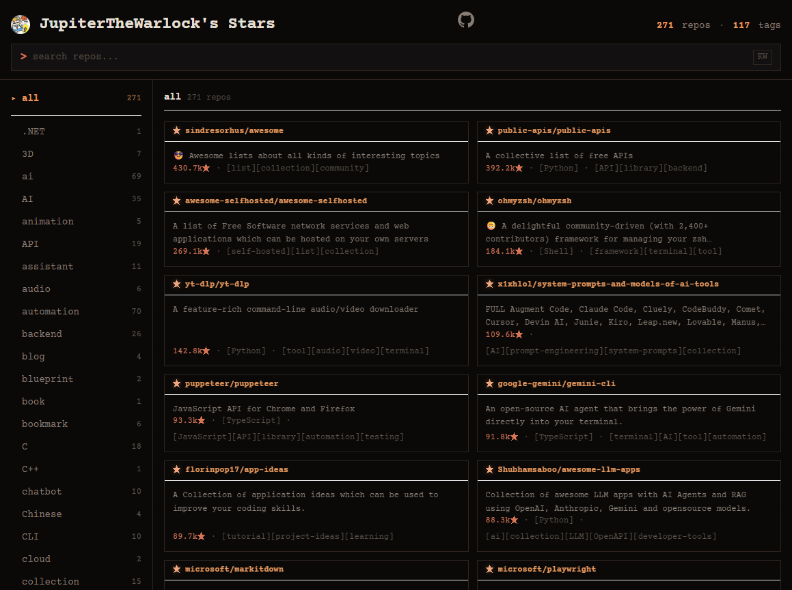

# myStarsBoard

JupiterTheWarlock's personal GitHub Stars board, powered by [StarsBoard](https://github.com/JupiterTheWarlock/StarsBoard).

## What is this

This repo automatically fetches my GitHub starred repositories, tags them with AI, and presents them in a searchable web UI.

**Live site:** [stars.jthewl.cc](https://stars.jthewl.cc/)

## StarsBoard Template

The framework code lives in the [StarsBoard](https://github.com/JupiterTheWarlock/StarsBoard) template repo. Changes to `src/`, `webui/`, and config files in this repo are automatically synced back to the template.

To create your own stars board, head over to [StarsBoard](https://github.com/JupiterTheWarlock/StarsBoard) and follow the setup guide.

## How it works

- **Daily auto-update** via GitHub Actions: fetches stars, generates AI tags, builds embeddings
- **Web UI** with keyword & semantic search, tag filtering, and a terminal aesthetic
- **Data** is embedded at build time for fast static deployment
