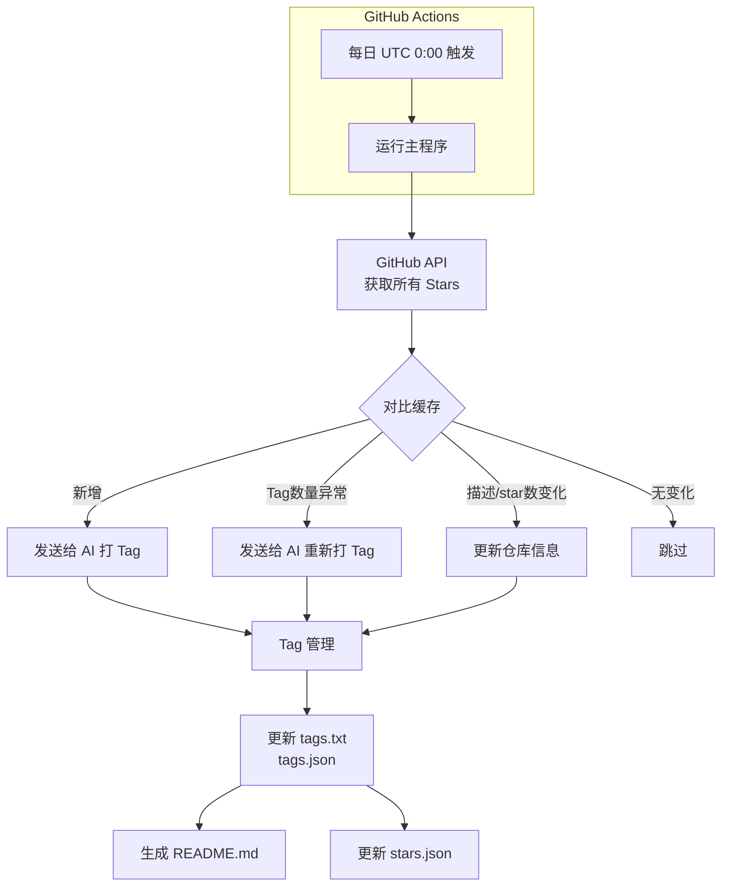
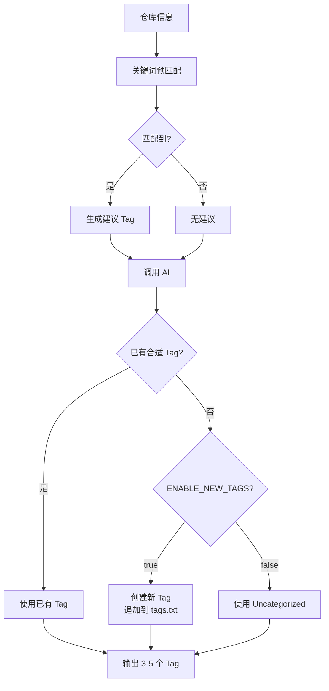

# StarsBoard 产品需求文档 (PRD)

## 1. 产品概述

### 1.1 产品定位
StarsBoard 是一个 GitHub Stars 自动标注与 README 生成系统，作为 **Template** 交付给用户。用户 fork 后配置环境变量即可使用，通过 GitHub Actions 每日自动运行，实现：

- 自动获取用户的所有 GitHub stars
- 使用 AI 智能为每个仓库打 tag
- 按_tag_分组生成结构化的 README.md
- 增量更新，高效处理变化

### 1.2 设计理念
类似 GitHub 官方的 Lists 功能，但 GitHub 未开放相关 API，因此自行实现。

---

## 2. 核心功能

### 2.1 功能清单

| 功能 | 描述 |
|------|------|
| **Stars 收集** | 每日自动从 GitHub API 获取用户的所有 stars，支持分页 |
| **AI 智能 Tag** | 使用 AI 为每个仓库生成 3-5 个描述性 tag |
| **Tag 管理** | Tag 列表持久化，支持增量新增，用户可自定义 |
| **关键词预匹配** | 基于关键词配置进行预匹配，作为 AI 决策的参考 |
| **README 生成** | 按 tag 分组生成 Markdown，自动更新 |
| **增量更新** | 只处理新增、变更、tag 数量异常的仓库 |
| **断点续传** | 保存处理进度，支持从中断处恢复 |
| **自动运行** | GitHub Actions 每日 UTC 0:00 自动触发 |

### 2.2 数据流



---

## 3. 数据文件结构

### 3.1 文件清单

| 文件路径 | 类型 | 说明 | Git 提交 |
|---------|------|------|---------|
| `datas/tags.txt` | 配置+数据 | Tag 列表，一行一个，AI 新增时追加 | 是 |
| `datas/tag-keywords.json` | 配置 | 关键词到 tag 的映射 | 是 |
| `datas/tags.json` | 数据 | Tag 与仓库的映射（运行时生成） | 否 |
| `datas/stars.json` | 数据 | Stars 原始数据（运行时生成） | 否 |

### 3.2 tags.txt
```
frontend
backend
ai
tutorial
util
Uncategorized
javascript
typescript
python
rust
go
java
```
- 用户可编辑，定义初始 tag
- AI 创建新 tag 时自动追加到末尾
- 顺序影响 AI 的 tag 选择倾向

### 3.3 tag-keywords.json
```json
{
  "frontend": ["react", "vue", "angular", "typescript", "javascript", "next", "nuxt"],
  "backend": ["api", "server", "express", "fastify", "nest", "django", "flask"],
  "ai": ["llm", "gpt", "claude", "transformer", "machine learning", "ml", "ai agent"],
  "util": ["tool", "utility", "helper", "cli", "script"],
  "tutorial": ["tutorial", "guide", "course", "learning", "book", "docs"]
}
```
- 可选配置，项目默认提供
- 用户自行维护，不自动更新

### 3.4 tags.json
```json
{
  "lastUpdated": "2025-01-19T10:05:00Z",
  "tags": {
    "frontend": {
      "repos": [123456, 789012],
      "count": 2
    },
    "Uncategorized": {
      "repos": [999999],
      "count": 1
    }
  },
  "repos": {
    "123456": {
      "tags": ["frontend", "typescript", "library"],
      "lastTaggedAt": "2025-01-19T10:05:00Z"
    }
  }
}
```

### 3.5 stars.json
```json
{
  "lastUpdated": "2025-01-19T10:00:00Z",
  "stars": [
    {
      "id": 123456,
      "name": "react",
      "fullName": "facebook/react",
      "description": "A JavaScript library for building user interfaces",
      "language": "JavaScript",
      "stars": 230000,
      "url": "https://github.com/facebook/react",
      "starredAt": "2024-01-15T08:30:00Z",
      "updatedAt": "2025-01-10T15:20:00Z"
    }
  ]
}
```

---

## 4. AI Tag 逻辑

### 4.1 Tag 生成流程



### 4.2 AI 输入结构

```javascript
{
  existingTags: ["frontend", "backend", "ai", "tutorial", "util", "Uncategorized", "javascript", "typescript", ...],  // 按 tags.txt 顺序
  suggestedTag: "frontend",  // 关键词预匹配结果，可能为空
  repo: {
    name: "react",
    fullName: "facebook/react",
    description: "A JavaScript library for building user interfaces",
    language: "JavaScript",
    topics: ["javascript", "library", "ui"]
  },
  config: {
    enableNewTags: true,
    tagCountMin: 3,
    tagCountMax: 5
  }
}
```

### 4.3 AI 输出

```javascript
["frontend", "typescript", "library"]  // 3-5 个 tag，顺序即为 section 顺序
```

### 4.4 Tag 新增规则

| 条件 | 行为 |
|------|------|
| AI 判断已有合适 tag | 使用已有 tag，不创建新 tag |
| `ENABLE_NEW_TAGS=true` 且无合适 tag | 创建新 tag，追加到 `tags.txt` 末尾 |
| `ENABLE_NEW_TAGS=false` 且无合适 tag | 使用 `Uncategorized` |
| 新 tag 包含特殊字符 | 过滤掉 `#`, `/`, `\` 等字符 |

---

## 5. README 生成

### 5.1 结构

```markdown
# {{README_TITLE}}

*Last updated: {{LAST_UPDATE}}*

**Stats:** {{TOTAL}} stars | {{TAG_COUNT}} tags

## Frontend (23)

- [react](https://github.com/facebook/react) - A JavaScript library for building user interfaces
  - *JavaScript ⭐ 230,000*

- [vue](https://github.com/vuejs/vue) - 🖖 Vue.js is a progressive, incrementally-adoptable JavaScript framework
  - *JavaScript ⭐ 210,000*

## Backend (15)
...

## Uncategorized (3)
...
```

### 5.2 排序规则

| 维度 | 规则 |
|------|------|
| Section 顺序 | 按 tag 在 `tags.txt` 中的顺序 |
| 仓库顺序 | 按 star 数量降序（热门的在前） |
| 空 section | 不显示在 README 中，tag 仍保留在 txt 和 json |

### 5.3 仓库展示

- 格式：`- [name](url) - description`
- 元信息：`*Language ⭐ StarCount*`
- 无语言时：不显示元信息行
- 不显示 tags（因为 section 就是按 tag 分组的）

---

## 6. 增量更新逻辑

### 6.1 每日运行流程

1. 从 GitHub API 获取所有 stars
2. 对比 `stars.json` 缓存，分类：
   - **新增**：API 有但缓存无 → 发送给 AI 打 tag
   - **删除**：缓存有但 API 无 → 从所有 tag 中移除
   - **更新**：description 或 stars 字段变化 → 更新仓库信息
   - **Tag 数量异常**：tag 数量不在 [MIN, MAX] 范围 → 发送给 AI 重新打 tag
   - **未变**：跳过

### 6.2 Tag 变更处理

如果用户从 `tags.txt` 中删除了某个 tag：

- 从 `tags.json` 中删除该 tag 的记录
- 所有使用该 tag 的仓库需要重新发送给 AI 重新打 tag
- README 中不再显示该 section

---

## 7. 配置

### 7.1 环境变量

| 配置项 | 默认值 | 必填 | 说明 |
|--------|--------|------|------|
| `GITHUB_TOKEN` | - | 是 | GitHub Personal Access Token |
| `GITHUB_USERNAME` | - | 是 | 要获取 stars 的用户名 |
| `OPENAI_API_KEY` | - | 是 | AI API Key |
| `OPENAI_BASE_URL` | `https://api.openai.com/v1` | 否 | AI API 地址 |
| `AI_MODEL` | `gpt-4o` | 否 | 使用的模型 |
| `ENABLE_NEW_TAGS` | `true` | 否 | 是否允许 AI 创建新 tag |
| `TAG_COUNT_MIN` | `3` | 否 | 最少 tag 数量 |
| `TAG_COUNT_MAX` | `5` | 否 | 最多 tag 数量 |
| `ENABLE_THINKING` | `false` | 否 | 是否启用思考模式 |
| `MAX_RETRIES` | `3` | 否 | API 失败重试次数 |
| `RETRY_DELAY_MS` | `1000` | 否 | 重试延迟（毫秒） |
| `ENABLE_LOGS` | `true` | 否 | 是否启用日志 |
| `LOGS_DIR` | `logs` | 否 | 日志目录 |
| `README_PATH` | `README.md` | 否 | README 文件路径 |
| `README_TITLE` | `⭐ My GitHub Stars` | 否 | README 标题 |
| `BATCH_SIZE` | `5` | 否 | AI 批量处理大小 |

### 7.2 .gitignore

```
.env
logs/
datas/*.json
node_modules/
```

---

## 8. 错误处理

### 8.1 API 失败处理

| 场景 | 处理方式 |
|------|---------|
| GitHub API 失败 | 重试最多 3 次，间隔 1 秒 |
| AI API 失败 | 重试最多 3 次，间隔 1 秒，失败后使用 `Uncategorized` |
| 网络/超时 | 同上 |

### 8.2 日志

- 存储路径：`logs/YYYY-MM-DD.log`
- 默认启用，可通过 `ENABLE_LOGS=false` 关闭
- 记录：运行状态、错误、警告、处理进度

### 8.3 边界情况

| 场景 | 行为 |
|------|------|
| GitHub 返回 0 stars | 删除所有 sections，只显示标题和"暂无 stars" |
| 仓库无 language | 不显示元信息行 |
| 所有仓库都被删除 | 删除所有 sections，tag 保留在 txt 和 json 中 |

---

## 9. GitHub Actions

### 9.1 配置

- **触发时间**：每日 UTC 0:00
- **手动触发**：支持 workflow_dispatch
- **中文注释**：详细说明如何修改触发时间、配置 Secrets、手动触发

### 9.2 Secrets 配置

用户需要在 GitHub Repository Settings 中配置：
- `GITHUB_TOKEN`
- `GITHUB_USERNAME`
- `OPENAI_API_KEY`
- （可选）`OPENAI_BASE_URL`
- （可选）`AI_MODEL`

---

## 10. Template 交付清单

### 10.1 交付内容

- [ ] 完整的源代码 (`src/`)
- [ ] `.env.example` 环境变量模板
- [ ] `datas/tags.txt` 默认 tag 列表
- [ ] `datas/tag-keywords.json` 默认关键词映射
- [ ] `.github/workflows/daily-stars.yml` CI/CD 配置（含中文注释）
- [ ] `README.md` 项目说明文档
- [ ] `.gitignore` 配置
- [ ] `package.json` 依赖配置
- [ ] 安装/配置文档

### 10.2 用户首次使用步骤

1. Fork 本仓库
2. 配置 GitHub Secrets（环境变量）
3. （可选）修改 `datas/tags.txt` 自定义初始 tag
4. （可选）修改 `datas/tag-keywords.json` 自定义关键词映射
5. 等待每日自动运行，或手动触发 workflow
6. 查看 README.md 生成的结果

---

## 11. 非功能需求

### 11.1 性能

- 单次处理 100+ stars 应在 5 分钟内完成
- 批量处理 AI 请求以减少 API 调用次数

### 11.2 可靠性

- 断点续传：支持从中断处恢复
- 原子更新：生成的文件先写临时文件，成功后再替换

### 11.3 可维护性

- 清晰的日志输出
- 模块化的代码结构
- 详细的注释和文档

---

## 12. 未来扩展（可选）

| 功能 | 优先级 | 说明 |
|------|--------|------|
| Web 界面 | 低 | 可视化配置和预览 |
| 多仓库支持 | 低 | 同时管理多个用户的 stars |
| 自定义 README 模板 | 低 | 用户自定义 README 样式 |
| Tag 合并/重命名 | 低 | 管理 tag 的生命周期 |
| 数据导出 | 低 | 导出为 JSON/CSV 等格式 |
